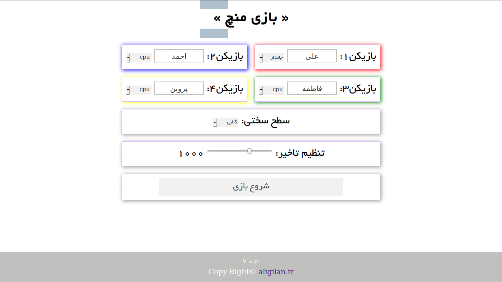
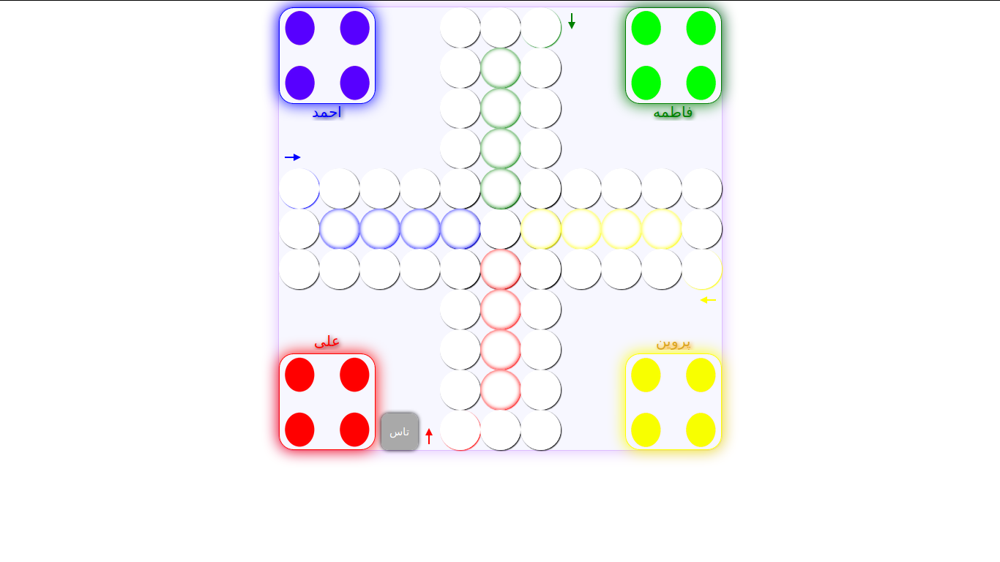
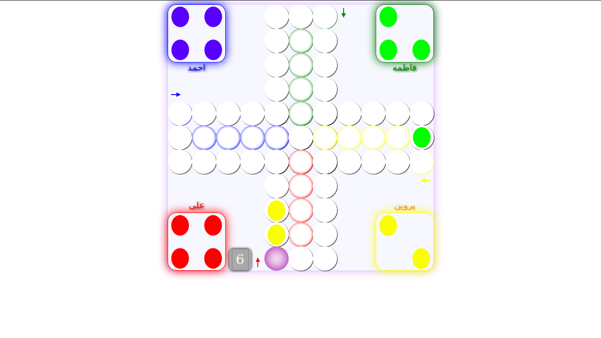

# Mench
A simple game with java script

-change player name.
-play alone with cpu or play with your friends.
-chenge difficulty.
-change game speed.
-play with drag & drop.
-play with touch ,on moblie or other devices.

Instalation:
Project first page form, uses very simple php code to send player's name and game setting to your local server,
so you need to move project files in server httpdocs. then game will start properly.

